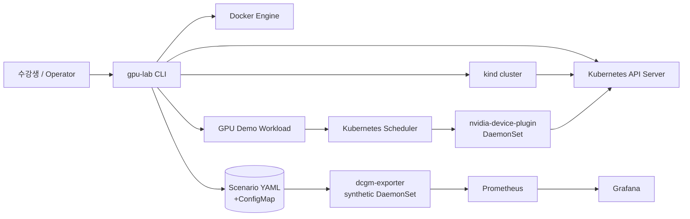

# gpu-lab Architecture Proposal

상태: Phase 1 설계를 기반으로 한 MVP 구현 문서

이 문서는 runtime architecture, 책임 경계, metric contract, scenario contract를 정의합니다. 현재 구현은 이 문서의 contract를 기준으로 진행 중이며, kind/Helm 기반 full e2e는 해당 도구가 설치된 환경에서 검증합니다.

## 1. 목표와 비목표

### 목표

1. GPU가 없는 일반 노트북에서 하나의 명령으로 재현 가능한 GPU 학습 환경을 만든다.
2. Kubernetes scheduler가 `nvidia.com/gpu`를 실제 Extended Resource처럼 판단하게 한다.
3. GPU 상태와 장애 신호를 Prometheus/Grafana에서 관찰하게 한다.
4. 동일한 Scenario를 실행하면 동일한 증상과 복구 절차를 반복할 수 있게 한다.
5. 모든 lab 리소스를 `gpu-lab`이 식별하고 reset/destroy할 수 있게 한다.

### 비목표

- 실제 GPU device file, NVIDIA driver, CUDA runtime을 제공하지 않는다.
- CUDA workload의 성능이나 정확도를 시뮬레이션하지 않는다.
- 실제 NVIDIA GPU cluster나 production GPU Operator를 대체하지 않는다.
- 임의의 외부 Kubernetes cluster를 관리하지 않는다. MVP는 gpu-lab이 만든 kind cluster만 대상으로 한다.

## 2. 핵심 설계 결정

### 2.1 Fake GPU는 Node patch가 아니라 Device Plugin으로 구현한다

worker Node의 `status.capacity`를 CLI가 직접 수정하는 방식은 kubelet의 실제 리소스 관리 흐름을 재현하지 못하고, 재시작·재조정 시 상태가 사라질 수 있습니다.

MVP에서는 각 worker에 synthetic `nvidia-device-plugin` DaemonSet을 실행합니다.

- 리소스 이름: `nvidia.com/gpu`
- worker별 가상 GPU 수: 8
- 가상 device ID: `gpu-<node-name>-00` ~ `gpu-<node-name>-07`
- 초기 상태: `Healthy`
- kubelet registration socket: `/var/lib/kubelet/device-plugins/`
- `Allocate` 응답: 실제 device mount 없이 lab 식별용 환경 변수와 annotation만 반환

따라서 scheduler는 GPU 요청을 인식하고 Pod 배치를 결정하지만, Pod 안에서 CUDA나 `/dev/nvidia*` 장치는 사용할 수 없습니다.

Device Plugin API와 kind container 내부의 kubelet socket 연결은 MVP의 최고 기술 리스크이며, Phase 2 초기에 독립 smoke test로 검증합니다.

### 2.2 GPU Operator 계층은 bootstrap behavior로 표현한다

MVP에는 실제 GPU Operator controller나 CRD를 만들지 않습니다. `gpu create`로 base cluster를 만든 뒤 수강생이 `gpu helm install`로 다음 구성요소를 선언된 순서로 설치합니다.

1. `nvidia-device-plugin`
2. `dcgm-exporter` synthetic telemetry layer
3. Prometheus
4. Grafana와 dashboard provisioning

이 설치·reconcile 흐름을 교육에서 “GPU Operator가 여러 GPU 구성요소를 묶어 설치·운영하는 방식”의 축약 모델로 설명합니다. 실제 GPU Operator CRD/controller 실습은 MVP 이후 확장 범위로 명시합니다.

### 2.3 `dcgm-exporter`는 node-local DaemonSet이다

`dcgm-exporter`는 Go로 작성하며 worker마다 하나의 Pod를 둡니다. Pod의 `NODE_NAME` 환경 변수로 자신의 node identity를 알고, 해당 node의 8개 가상 GPU metric을 생성합니다. 이름과 운영 흐름은 DCGM Exporter에 맞추지만 metric 값은 synthetic입니다.

Exporter는 Kubernetes API를 통해 `gpu-lab-system/gpu-lab-scenario` ConfigMap을 읽고 watch합니다. Scenario를 실행할 때 CLI가 ConfigMap을 갱신하면 모든 exporter가 새 generation을 받아 metric projection을 갱신합니다.

이 구조에서는 CLI가 exporter Pod에 직접 RPC를 보내지 않아도 되고, scenario 상태가 cluster 안에 남아 강의 중 관찰하기 쉽습니다.

### 2.4 Scenario는 선언 상태와 제어 action을 분리한다

모든 scenario는 YAML 파일로 저장하고 CLI가 schema validation 후 적용합니다.

- 선언 상태: metric override, target node, incident metadata
- 제어 action: scheduling failure workload 생성, exporter endpoint fault 전환 등
- 소유권: `app.kubernetes.io/managed-by=gpu-lab`, `gpu-lab/scenario=<name>` label
- 복구: `scenario reset`이 ConfigMap을 `normal`로 되돌리고 scenario-owned workload/action을 제거

Scenario 실행은 destructive한 cluster-wide 조작이 아니라 gpu-lab이 만든 namespace와 리소스에 한정합니다.

## 3. 시스템 구성

### 3.1 Component diagram



### 3.2 Runtime topology

```text
Docker
└── kind: gpu-lab
    ├── control-plane
    │   ├── kube-apiserver
    │   └── kube-scheduler
    ├── gpu-node-01
    │   ├── nvidia-device-plugin
    │   └── dcgm-exporter
    ├── gpu-node-02
    │   ├── nvidia-device-plugin
    │   └── dcgm-exporter
    ├── gpu-node-03
    │   ├── nvidia-device-plugin
    │   └── dcgm-exporter
    └── monitoring namespace
        ├── Prometheus
        └── Grafana
```

### 3.3 Namespace와 label

| 영역 | namespace | 책임 |
|---|---|---|
| GPU lab system | `gpu-lab-system` | device plugin, exporter, scenario ConfigMap |
| Monitoring | `gpu-lab-monitoring` | Prometheus, Grafana, ServiceMonitor/targets |
| Demo workload | `gpu-lab-demo` | 강의용 GPU workload와 failure workload |

공통 label은 다음을 사용합니다.

```text
app.kubernetes.io/part-of=gpu-lab
app.kubernetes.io/managed-by=gpu-lab
gpu-lab/scenario=<scenario-name>   # scenario-owned resource에만 사용
```

## 4. Fake GPU 설계

### 4.1 Node identity

kind worker는 다음 label을 가집니다.

```text
gpu.lab/type=fake
gpu.lab/node-id=gpu-node-01
```

기본 topology는 control-plane 1개와 worker 3개입니다. 사용자가 확인할 수 있도록 worker 이름은 `gpu-node-01`부터 시작합니다.

### 4.2 Resource lifecycle

```text
`nvidia-device-plugin` starts
    ↓
register nvidia.com/gpu with kubelet
    ↓
ListAndWatch 8 Healthy virtual devices
    ↓
kubelet publishes node capacity/allocatable
    ↓
scheduler places Pod requesting nvidia.com/gpu
    ↓
kubelet calls Allocate
    ↓
Pod starts with lab metadata, but no real GPU device
```

Pod spec의 교육용 예시는 다음 형태를 사용합니다.

```yaml
resources:
  limits:
    nvidia.com/gpu: 1
```

`requests`와 `limits`의 Kubernetes resource semantics를 강의에서 확인할 수 있도록 실제 workload manifest에도 같은 값을 명시합니다. 8개를 초과하는 요청은 Pending 상태가 되며 `scheduling-failure` scenario가 이를 사용합니다.

### 4.3 안전 경계

이 synthetic `nvidia-device-plugin`은 host의 `/dev`, GPU driver, Docker socket을 필요로 하지 않습니다. 필요한 hostPath는 kubelet device-plugin socket 디렉터리로 제한합니다. 이 경계를 깨는 privileged mount는 MVP에서 허용하지 않습니다.

## 5. `dcgm-exporter` 설계

### 5.1 HTTP contract

| Endpoint | 용도 |
|---|---|
| `GET /metrics` | Prometheus scrape endpoint |
| `GET /healthz` | process health |
| `GET /readyz` | scenario state를 읽을 준비 여부 |
| `GET /api/v1/state` | 현재 node와 scenario projection 확인 |

`exporter-down` scenario에서는 대상 exporter가 `/metrics`와 `/readyz`에 HTTP 503을 반환하여 Prometheus target down을 관찰하게 합니다. Process는 살아 있어 reset 시 즉시 정상화할 수 있습니다.

### 5.2 Metric contract

모든 metric은 실제 DCGM metric과 혼동하지 않도록 `gpu_lab_` prefix를 사용합니다.

| Metric | Type | 주요 label | 의미 |
|---|---|---|---|
| `gpu_lab_gpu_utilization_percent` | Gauge | `node`, `gpu` | 가상 GPU 사용률, 0–100 |
| `gpu_lab_gpu_memory_used_bytes` | Gauge | `node`, `gpu` | 가상 VRAM 사용량 |
| `gpu_lab_gpu_memory_total_bytes` | Gauge | `node`, `gpu` | 가상 VRAM 총량 |
| `gpu_lab_gpu_temperature_celsius` | Gauge | `node`, `gpu` | 가상 온도 |
| `gpu_lab_gpu_power_watts` | Gauge | `node`, `gpu` | 가상 소비 전력 |
| `gpu_lab_gpu_xid_code` | Gauge | `node`, `gpu` | 현재 가상 XID code, 없으면 0 |
| `gpu_lab_gpu_health` | Gauge | `node`, `gpu` | 정상 1, 비정상 0 |
| `gpu_lab_gpu_health_status` | Gauge | `node`, `gpu` | DCGM 스타일 상태: 0 PASS, 10 WARN, 20 FAIL |
| `gpu_lab_gpu_ecc_dbe_total` | Counter | `node`, `gpu` | 가상 uncorrectable double-bit ECC 누적 수 |
| `gpu_lab_gpu_power_violation_total` | Counter | `node`, `gpu` | 가상 power-limit violation 누적 수 |
| `gpu_lab_gpu_pcie_replay_total` | Counter | `node`, `gpu` | 가상 PCIe replay 누적 수 |
| `gpu_lab_gpu_throttle_active` | Gauge | `node`, `gpu`, `reason` | 가상 clock throttling 상태 |
| `gpu_lab_gpu_allocated` | Gauge | `node`, `gpu` | 가상 workload 할당 상태 |
| `gpu_lab_node_gpu_capacity` | Gauge | `node` | 가상 Node GPU capacity |
| `gpu_lab_node_gpu_allocatable` | Gauge | `node` | 가상 Node GPU allocatable |
| `gpu_lab_exporter_up` | Gauge | `node` | exporter projection 정상 여부 |
| `gpu_lab_scenario_info` | Gauge | `node`, `scenario` | 활성 scenario를 나타내는 1 |
| `gpu_lab_scenario_generation` | Gauge | `node` | 적용된 scenario generation |

Metric 값은 교육용 현상 표현을 위한 합성값입니다. 실제 NVIDIA DCGM field name, sampling interval, error semantics와 동일하다고 주장하지 않습니다.

### 5.3 기본 profile

`normal`은 모든 GPU에 대해 다음의 안정적인 baseline을 사용합니다.

- utilization: 15%
- memory: total의 20%
- temperature: 45°C
- power: 80W
- XID: 0
- health: 1

Scenario는 baseline에 override를 적용합니다. 값을 지정하지 않은 field는 baseline을 유지합니다.

## 6. Scenario Engine

### 6.1 YAML contract 초안

```yaml
apiVersion: gpu-lab.io/v1alpha1
kind: Scenario
metadata:
  name: gpu-util-high
spec:
  description: Sustained high GPU utilization
  duration: 10m
  targets:
    selector:
      gpu.lab/type: fake
  metrics:
    gpu_utilization_percent: 95
    temperature_celsius: 78
    power_watts: 220
  actions: []
```

MVP scenario 파일은 `scenarios/`에 두고, `metadata.name`과 filename을 일치시킵니다.

### 6.2 MVP scenario 목록

| Scenario | 증상 | 구현 방식 |
|---|---|---|
| `normal` | baseline 상태 | ConfigMap을 baseline으로 설정 |
| `gpu-util-high` | 사용률·온도·전력 상승 | exporter metric override |
| `vram-pressure` | VRAM 사용량 임계치 초과 | memory used override |
| `xid-79` | GPU fallen off bus에 해당하는 XID 신호 | XID 79, health 0 override |
| `exporter-down` | Prometheus target down | 대상 exporter HTTP fault |
| `scheduling-failure` | GPU Pod Pending | 9 GPU 요청 workload 생성 |
| `thermal-throttling` | 고온과 처리량 저하 | 온도·전력·사용률 조합 override |
| `xid-48` | double-bit ECC 장애 신호 | XID 48, health 0 override |
| `gpu-idle` | GPU를 예약했지만 사용률이 거의 없음 | 1 GPU workload와 저사용률 metric |
| `ecc-double-bit` | uncorrectable double-bit ECC 신호 | ECC counter, XID 48, health 0 override |
| `power-throttle` | power limit으로 인한 clock throttling | power violation과 throttle reason override |
| `pcie-replay` | PCIe link replay 증가 | PCIe replay counter override |
| `gpu-allocated-idle` | GPU가 할당됐지만 거의 사용되지 않음 | allocation metric과 Running workload |
| `gpu-capacity-mismatch` | telemetry capacity와 allocatable 불일치 | synthetic Node resource metric과 workload |
| `node-selector-mismatch` | 존재하지 않는 GPU profile을 요구해 Pending | nodeSelector 불일치 workload |
| `gpu-fragmentation` | 전체 여유 GPU는 있지만 2 GPU Pod가 Pending | node별 7 GPU 선점 후 2 GPU 요청 |

`xid-79`는 실제 driver 장애를 발생시키지 않습니다. XID code와 health metric만 바꾸며, 이 차이를 troubleshooting 문서에서 명시합니다.

### 6.3 실행 흐름

```text
gpu-lab scenario run xid-79
    ↓
read scenarios/xid-79.yaml
    ↓
validate schema and safety constraints
    ↓
write gpu-lab-system/gpu-lab-scenario ConfigMap
    ↓
exporter watches new generation
    ↓
Prometheus scrapes changed metrics
    ↓
student investigates Grafana → Prometheus → exporter state
```

Scenario command는 ConfigMap generation과 필요한 workload를 적용한 뒤 결과를 출력합니다. `wait_for_ready: true`인 workload는 Ready까지 기다리며, metric 반영과 Pending 원인은 runbook의 Prometheus 및 `kubectl describe` 명령으로 확인합니다.

### 6.4 Reset semantics

`gpu-lab scenario reset`은 다음을 보장합니다.

1. Scenario ConfigMap을 `normal`로 설정한다.
2. `gpu-lab/scenario` label이 있는 workload와 auxiliary resource를 제거한다.
3. exporter fault를 해제한다.
4. Prometheus target과 metric baseline 확인은 runbook의 검증 명령으로 수행한다.

`reset`은 사용자가 만든 namespace나 workload를 삭제하지 않습니다. `destroy`만 gpu-lab kind cluster 전체를 삭제합니다.

## 7. Monitoring stack

MVP는 `kube-prometheus-stack` Helm chart를 고정된 values와 함께 설치합니다. `gpu create`는 monitoring을 설치하지 않으며, 수강생이 `gpu helm install monitoring`을 실행했을 때 공식 Helm CLI가 `gpu-lab-monitoring` release를 생성합니다.

### Prometheus

- `dcgm-exporter` Service를 scrape한다.
- `gpu-lab-monitoring` namespace의 ServiceMonitor가 `gpu-lab-system` namespace의 exporter Service를 `namespaceSelector`로 가리키게 한다.
- Prometheus values에서 ServiceMonitor selector와 namespace selector를 명시해 chart의 기본 release-label 필터에 의존하지 않는다.
- `gpu_lab_` metric 기반의 기본 alert rule을 provision한다.
- alert 예시: high utilization, VRAM pressure, XID present, exporter target down, pending GPU workload.

### Grafana

- Prometheus를 default datasource로 provision한다.
- GPU Lab dashboard JSON을 ConfigMap으로 provision한다.
- panel은 node/GPU 선택, utilization, memory ratio, temperature, power, XID, health, exporter availability를 포함한다.
- dashboard에 “Synthetic metric / not real DCGM” 경고를 표시한다.

Helm chart와 image version은 재현성을 위해 파일에서 명시적으로 pin하고, CI에서 변경을 감지합니다.

## 8. CLI 설계

수강생용 CLI binary 이름은 `gpu`이며 Go로 구현합니다. 기존 자동화 호환을 위해 동일한 binary를 `gpu-lab` 이름으로도 배포합니다. 외부 command 실행은 shell string 조합이 아니라 argument 배열 기반 process runner를 사용합니다.

| Command | 책임 |
|---|---|
| `gpu create` | 의존성 확인, kind cluster 생성, runtime image load, node readiness 대기 |
| `gpu create --all` | base cluster 생성 후 모든 component를 순서대로 설치하는 CI/개발 shortcut |
| `gpu destroy` | gpu-lab kind cluster 삭제 |
| `gpu reset` | scenario reset과 lab-owned 상태 복구 |
| `gpu doctor` | Docker, kind, kubectl, helm, context, port, image pull 가능 여부 진단 |
| `gpu status` | node/resource/pod/monitoring/scenario 요약 |
| `gpu dashboard [--port <port>]` | Grafana service port-forward shortcut |
| `gpu metrics [--query <PromQL>] [--json]` | 기본 GPU metric 또는 custom PromQL 조회 |
| `gpu nvidia-smi ...` | synthetic telemetry를 NVIDIA-SMI 호환 표/CSV로 조회 |
| `gpu context list` | 현재 context와 사용 가능한 kubeconfig context 표시 |
| `gpu context setup` | dedicated kubeconfig와 `gpu-lab` alias context 생성 |
| `gpu context use <name>` | 기본 kubeconfig의 current-context 전환 |
| `gpu scenario list` | 내장 YAML scenario 목록 표시 |
| `gpu scenario run <name>` | scenario 검증·적용·상태 확인 |
| `gpu scenario inspect <name>` | 실행 전 scenario duration, target, metric, action 확인 |
| `gpu scenario reset` | `normal` 복구 |
| `gpu verify <name>` | active ConfigMap, Prometheus metric, Pod phase/event 검증 |
| `gpu helm catalog` | 설치 가능한 교육용 Helm component 표시 |
| `gpu helm install <component>` | component shorthand를 실제 공식 `helm install`로 확장 |
| `gpu helm <official-helm-args...>` | 일반 공식 Helm CLI 명령 실행 |

### Official CLI passthrough

Helm chart repository, plugin, OCI registry, authentication, version 선택은 공식 Helm CLI의 책임으로 둡니다. gpu는 Helm client를 재구현하지 않습니다. GPU Lab component 이름만 versioned GHCR OCI chart 또는 고정된 official chart와 release metadata로 해석합니다. 개발 빌드는 publish 전 검증을 위해 같은 chart의 embedded copy를 사용합니다.

```bash
gpu helm install nvidia-device-plugin
gpu helm install dcgm-exporter
gpu helm install monitoring
gpu helm list --all-namespaces

gpu helm repo add prometheus-community https://prometheus-community.github.io/helm-charts
gpu helm search repo prometheus-community/kube-prometheus-stack
```

구현 규칙:

- 알려진 component shorthand는 release, chart, namespace, values로 확장한 뒤 `helm install`을 실행한다.
- 일반 `gpu helm` 인자는 공식 `helm` 프로세스에 argument 배열로 전달한다.
- shell 문자열을 만들지 않고 `exec.CommandContext`의 argument 배열로 실행한다.
- `create`는 Helm을 호출하지 않는다. component 설치 lifecycle은 `gpu helm`이 전담한다.
- Helm이 없으면 doctor가 공식 설치 문서와 `gpu helm` 사용 조건을 안내한다.
- cluster-aware Helm 명령은 기본적으로 `gpu-lab` context를 사용하고, 명시된 사용자 context는 덮어쓰지 않는다.

### Idempotency

- cluster name은 `gpu-lab`으로 고정한다.
- kubectl context alias는 `gpu-lab`으로 고정하고, kind의 원래 `kind-gpu-lab` context는 보존한다.
- dedicated kubeconfig는 `${HOME}/.kube/gpu-lab.config`에 저장한다.
- create는 이미 존재하는 cluster를 재사용하지만 component를 자동 설치하거나 변경하지 않는다.
- destroy 대상은 kind cluster 이름을 명시적으로 확인한 뒤 삭제한다.
- CLI는 `gpu-lab` context를 확인하며, 다른 context에 apply하지 않는다.

현재 kubeconfig의 active context와 무관하게 모든 gpu-lab mutation에는 `--context gpu-lab` 또는 `--kube-context gpu-lab`을 명시한다.

### 사용자 경험

성공 시 다음 정보를 출력합니다.

- cluster/context 이름
- node별 GPU capacity
- Prometheus/Grafana 접근 방법
- 현재 scenario
- 다음 강의 실습 명령

실패 시 단계, 원인 후보, 복구 명령을 함께 출력합니다. 구조화된 결과가 필요한 명령은 `--json`을 제공하고, long-running 접근 명령은 포트와 context를 명시적으로 선택할 수 있게 합니다.

## 9. Repository structure proposal

```text
gpu-lab/
├── README.md
├── LICENSE                         # MIT license
├── go.mod
├── go.sum
├── Makefile
├── cmd/
│   ├── gpu-lab/                    # user-facing CLI
│   ├── nvidia-device-plugin/     # kubelet device plugin
│   └── dcgm-exporter/          # Prometheus exporter
├── internal/
│   ├── cli/
│   ├── cluster/
│   ├── dependencies/
│   ├── kubernetes/
│   ├── monitoring/
│   ├── scenario/
│   └── output/
├── api/
│   └── scenario/v1alpha1/          # Go types and schema
├── scenarios/                      # built-in YAML scenarios
├── deploy/
│   ├── kind/
│   ├── device-plugin/
│   ├── exporter/
│   ├── monitoring/
│   └── demo/
├── dashboards/
├── test/
│   ├── unit/
│   ├── integration/
│   └── e2e/
├── docs/
│   ├── architecture.md
│   ├── metric-mapping.md
│   ├── support-matrix.md
│   ├── troubleshooting.md
│   └── synthetic-vs-real.md
└── .github/
    └── workflows/
```

`cmd/`에는 process entrypoint만 두고, cluster mutation과 scenario semantics는 `internal/`에서 테스트 가능하게 분리합니다. `deploy/`의 선언 파일은 Go 코드와 독립적으로 검토·수정할 수 있어 강의 자료와 연결하기 쉽습니다.

## 10. Phase 2 이후 구현 순서

### Phase 2 — Infrastructure

완료 기준:

- `gpu create`의 최소 cluster bootstrap이 동작한다.
- control-plane 1개와 worker 3개가 Ready다.
- `gpu helm install nvidia-device-plugin`이 실제 Helm release를 만든다.
- 각 worker에 `nvidia.com/gpu: 8` capacity/allocatable이 보인다.
- GPU 요청 1개 Pod가 worker에 배치된다.
- `gpu helm install dcgm-exporter`와 `gpu helm install monitoring`이 독립 release를 만든다.
- Prometheus와 Grafana가 Ready다.

### Phase 3 — Exporter

완료 기준:

- exporter DaemonSet이 모든 fake GPU node에 뜬다.
- `/metrics`가 위의 metric contract를 만족한다.
- Prometheus target이 정상 scrape된다.
- `/api/v1/state`와 readiness가 scenario generation을 반영한다.

### Phase 4 — Scenario Engine

완료 기준:

- 모든 기본 scenario가 YAML만으로 재현된다.
- 실행 후 metric 또는 scheduling 증상이 확인된다.
- reset 후 baseline과 cluster health가 복구된다.
- scenario-owned resource가 사용자 리소스와 섞이지 않는다.

### Phase 5 — CLI

완료 기준:

- Linux, macOS, WSL2에서 doctor와 lifecycle command가 동작한다.
- 잘못된 context, dependency, port, partial install을 설명 가능한 오류로 반환한다.
- 동일 명령을 반복 실행해도 중복 리소스가 생기지 않는다.

### Phase 6 — Integration Test

최소 acceptance flow:

```text
create
  → 4 nodes Ready
  → helm install nvidia-device-plugin
  → 3 workers expose 8 fake GPUs each
  → helm install dcgm-exporter
  → helm install monitoring
  → GPU workload schedules
  → Grafana dashboard loads
  → run gpu-util-high
  → metric changes are visible
  → run xid-79
  → XID/health symptom is visible
  → run scheduling-failure
  → workload remains Pending for the documented reason
  → scenario reset
  → normal baseline returns
  → destroy
```

CI는 Linux Docker runner에서 `create → 3개 Helm component 단계별 설치 → 모든 기본 scenario → verify → reset → destroy` full e2e를 수행합니다. 로컬 macOS/WSL2에서는 `E2E_KEEP_CLUSTER=1 make e2e`로 cluster를 보존하는 smoke test를 실행할 수 있습니다. kind, kubectl, Helm과 chart version은 CI workflow에서 고정하고, 버전 변경은 별도 dependency update PR로 다룹니다.

## 11. 기술적 리스크

| Risk | 영향 | 완화책 |
|---|---|---|
| kind kubelet과 Device Plugin socket 연결 | Extended Resource가 Node에 나타나지 않을 수 있음 | Phase 2 첫 smoke test, pinned kind/node image, plugin registration 로그 검증 |
| empty `Allocate` 응답의 kubelet 호환성 | GPU 요청 Pod가 시작되지 않을 수 있음 | API contract test와 실제 kind e2e, 실패 시 metadata-only response 명시 |
| Helm/chart/image version drift | create 재현성 저하 | chart version과 image digest pin, CI smoke test |
| Docker Desktop/WSL2 차이 | resource, port, filesystem 동작 차이 | doctor 사전 진단, OS별 문서와 수동 smoke matrix |
| exporter fault의 즉시 복구 | exporter-down이 실제로 target down이 되지 않을 수 있음 | HTTP 503 기반 fault mode와 Prometheus target e2e 검증 |
| XID의 실제 의미 오해 | 학습자가 합성 신호를 실제 장애로 오인 | 모든 dashboard/README/docs에 synthetic 경고 표시 |
| scenario reset의 잔여 리소스 | 다음 실습 오염 | 공통 label, owner scope, reset acceptance test |
| Prometheus/Grafana 설치 시간 | 초보자 경험 저하 | progress output, readiness timeout, doctor에서 image pull 확인 |

가장 먼저 구현할 것은 Device Plugin의 registration과 `nvidia.com/gpu` capacity 노출입니다. 이것이 실패하면 이후 monitoring은 GPU infrastructure 학습이라는 목표를 충분히 충족하지 못합니다.

## 12. Synthetic 환경과 실제 환경의 차이

| gpu-lab | 실제 GPU cluster |
|---|---|
| virtual device ID | 실제 PCI/NVIDIA device |
| no `/dev/nvidia*` | NVIDIA driver와 device file 존재 |
| 합성 utilization/memory/temperature | DCGM이 수집한 hardware telemetry |
| XID metric override | 실제 driver/kernel/firmware error |
| kind scheduler/resource lifecycle | managed/on-prem Kubernetes 운영 환경 |
| chart bootstrap approximation | NVIDIA GPU Operator controller와 CRD |
| local Docker failure domain | 실제 node, network, storage, power failure |

따라서 gpu-lab에서 익히는 것은 다음의 운영 사고 과정입니다.

```text
resource request
  → scheduler decision
  → exporter signal
  → Prometheus query/alert
  → dashboard observation
  → incident hypothesis
  → controlled reset and verification
```

실제 CUDA 성능, GPU memory correctness, driver recovery, MIG, RDMA, multi-instance GPU, node-level firmware 문제는 이 프로젝트의 검증 대상이 아닙니다.

## 13. 공개 OSS 정책 제안

첫 공개 전 다음을 확정합니다.

- SPDX 라이선스와 third-party notices
- 지원 버전 정책: Go, Kubernetes/kind, Helm chart, Docker
- 변경 규칙: architecture/manifest/CLI 변경 시 관련 문서와 테스트 동반
- issue template: bug, scenario proposal, documentation
- security policy: local-only tool의 취약점 신고 경로
- release artifact: OS별 CLI binary와 source archive

현재 저장소는 이 정책을 결정하기 전의 설계 단계이므로, 라이선스를 추정하여 추가하지 않았습니다.

## 14. 설계 참고 자료

- [Kubernetes Device Plugins](https://kubernetes.io/docs/concepts/extend-kubernetes/compute-storage-net/device-plugins/)
- [kind Configuration](https://kind.sigs.k8s.io/docs/user/configuration/)
- [kind Quick Start — Multi-node clusters](https://kind.sigs.k8s.io/docs/user/quick-start/)
- [Prometheus Community kube-prometheus-stack](https://github.com/prometheus-community/helm-charts/tree/main/charts/kube-prometheus-stack)
